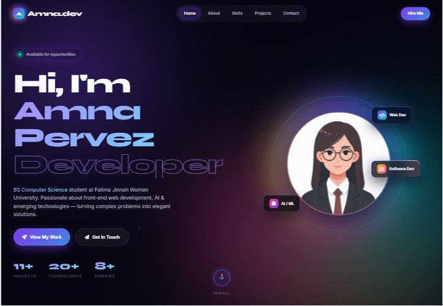

# Amna Pervez — Personal Portfolio
​
A responsive single-page personal portfolio website for **Amna Pervez**, a BS Computer Science student and developer.
​
## Live Website
https://amnapervez8910.github.io/tsg-webdev-p01-amna-pervez/

## Features
​
- Responsive navigation with smooth scrolling
- Hero section with introduction and call-to-action buttons
- About section with downloadable CV
- Skills and technology section with rating indicators
- Featured projects grid with project reports and repository links
- Contact form with basic JavaScript validation
- Mobile navigation menu
- Scroll-to-top button
- Animated reveal effects and hover interactions
- Responsive layout for mobile, tablet, and desktop screens
​
## Technologies Used
​
- HTML5
- CSS3
- Flexbox
- CSS Grid
- Vanilla JavaScript (ES6)
- Google Fonts
- Font Awesome
- GitHub Pages
​
## Project Structure
​
```text
.
├── index.html
├── styles.css
├── script.js
├── resume.pdf
└── README.md
```
​
## Screenshots
​
### Mobile View
​

​
### Tablet View
​

​
### Desktop View
​

​
## Credits
​
- Google Fonts: Syne, Inter, and JetBrains Mono
- Font Awesome icons
- Project and profile images used in the website should be credited or replaced with properly licensed/local images.
​
## Author
​
**Amna Pervez**
​
- GitHub: [amnapervez8910](https://github.com/amnapervez8910)
- LinkedIn: [Amna Pervez](https://www.linkedin.com/in/amna-pervez-1b2078389)
​
